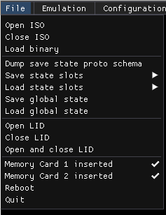
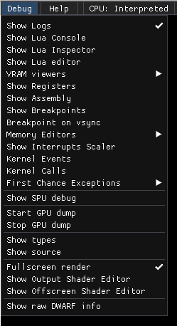
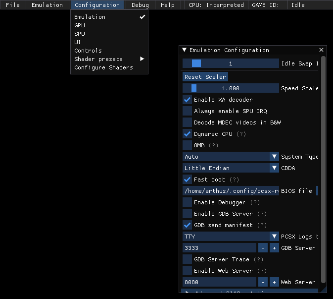
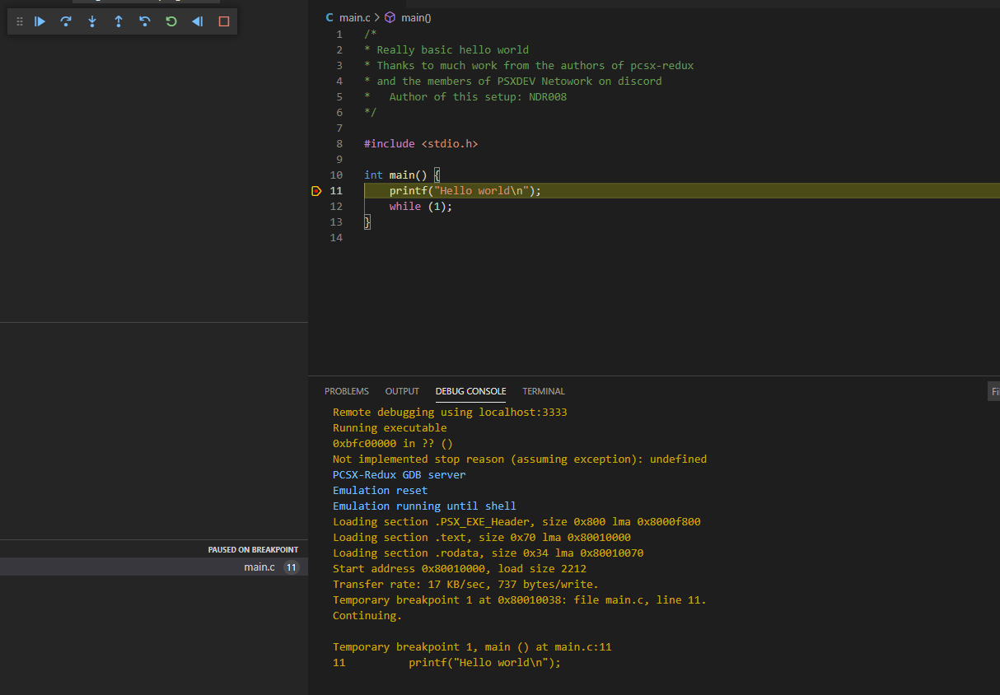
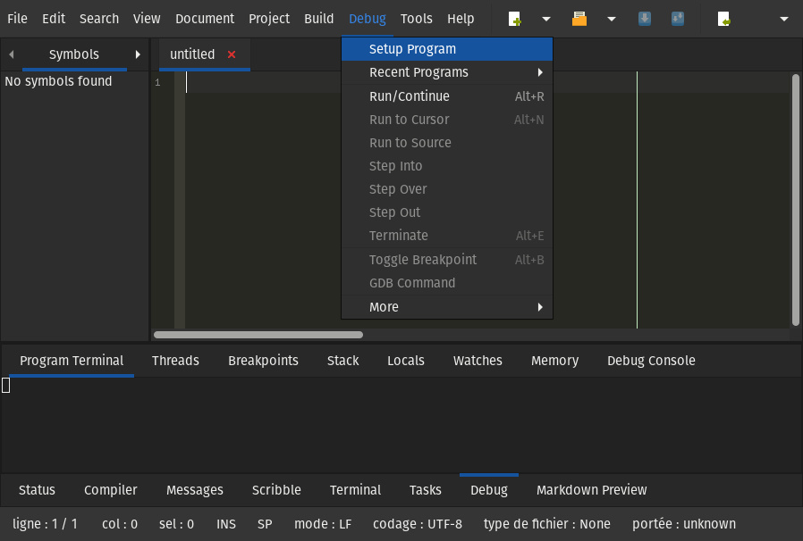
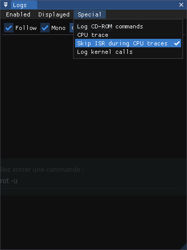

## Menus

# Pcsx-redux menus

The menu bar holds some informations :


  * CPU mode
  * Game ID
  * ImGui FPS counter (not psx internal fps)

## File



  * Open ISO
  * Close ISO
  * Load Binary
  * Dump save state proto schema
  * Save state slots
  * Load state slots
  * Save global state
  * Load global state
  * Open Lid : Simulate open lid
  * Close Lid : Simulate closed lid
  * Open and Close Lid : Simulate open then closed lid
  * MC1 inserted
  * MC2 inserted
  * Reboot : Restart emulator
  * Quit

## Emulation


  * Start : Start execution
  * Pause : Pause execution
  * Soft reset : Calls Redux's CPU reset function, which jumps to the BIOS entrypoint (0xBFC00000), resets some COP0 registers and the general purpose registers, and resets some IO. Does not clear vram.
  * Hard reset : Similar to a reboot of the PSX.

## Configuration


  * Emulation : Emulation settings
  * GPU : graphical processor settings
  * SPU : Sound processor settings
  * UI : Change interface settings
  * Controls : Edit KB/Pad controls
  * Shader presets : Apply a shader preset
  * Configure shaders : show shader editor
## Debug



## Help

  * Show Imgui demo
  * About

## Compiling

# Compiling Pcsx-redux

## Getting the sources
The only location for the source is [on github](https://github.com/grumpycoders/pcsx-redux/). Clone recursively, as the project uses submodules: 

`git clone https://github.com/grumpycoders/pcsx-redux.git --recursive`.

## Windows

Install [Visual Studio 2019 Community Edition](https://visualstudio.microsoft.com/thank-you-downloading-visual-studio/?sku=Community&rel=16).   
Open the file `vsprojects\pcsx-redux.sln`, select `pcsx-redux -> pcsx-redux`, right click, `Set as Startup Project`, and hit `F7` to build.  
The project follows the open-and-build paradigm with no extra step, so no specific dependency ought to be needed, as [NuGet](https://www.nuget.org/)
will take care of downloading them automatically for you on the first build.

Note: If you get an error saying `hresult e_fail has been returned from a call to a com component`, you might need to delete the .suo file in vsproject/vs, restart Visual Studio and retry.

## Linux

### Compiling with Docker

Run `./dockermake.sh`. You need [docker](https://en.wikipedia.org/wiki/Docker_(software)) for this to work.
```bash
# Debian derivative; Ubuntu, Mint...
sudo apt install docker
# Arch derivative; Manjaro...
sudo pacman -S docker
```

You will also need a few libraries on your system for this to work. 
Check the [Dockerfile](https://github.com/grumpycoders/pcsx-redux/blob/main/tools/build/Dockerfile#L22) for a list of library packages to install.

### Compiling with make

 - Debian derivatives ( for full emulator compilation ):

```bash
sudo apt-get install -y build-essential git make pkg-config clang g++ g++-mipsel-linux-gnu cpp-mipsel-linux-gnu binutils-mipsel-linux-gnu libfreetype-dev libavcodec-dev libavformat-dev libavutil-dev libglfw3-dev libswresample-dev libuv1-dev zlib1g-dev
```

 - Arch derivatives :

```bash
sudo pacman -S clang git make pkg-config ffmpeg libuv zlib glfw-x11 curl xorg-server-xvfb
```

You can then just enter the 'pcsx-redux' directory and compile without using docker with `make`.

Building OpenBIOS on Linux can be done with `./dockermake.sh -C src/mips/openbios`, or using the `g++-mipsel-linux-gnu` package with `make -C src/mips/openbios`. If you have a different mips compiler, you'll need to override some variables, such as `PREFIX=mipsel-none-elf FORMAT=elf32-littlemips`.

### MacOS
You need MacOS Catalina with the latest XCode to build, as well as a few [homebrew](https://brew.sh/) packages. Run the [brew installation script](https://github.com/grumpycoders/pcsx-redux/blob/main/.github/scripts/install-brew-dependencies.sh) to get all the necessary dependencies. Simply run `make` to build.

Compiling OpenBIOS will require a mips compiler, that you can generate using the following commands:
```bash
brew install ./tools/macos-mips/mipsel-none-elf-binutils.rb
brew install ./tools/macos-mips/mipsel-none-elf-gcc.rb
```

Then, you can compile OpenBIOS using `make -C ./src/mips/openbios`.

## Compiling PSX code

If you're only interested in compiling psx code, you can clone the pcsx-redux repo; 
```bash
git clone https://github.com/grumpycoders/pcsx-redux.git --recursive
```  
then install a mips toolchain and get the converted PsyQ libraries in the `pcsx-redux/src/mips/psyq/` folder as per  [these instructions](https://github.com/ABelliqueux/pcsx-redux/blob/main/src/mips/psyq/README.md).

You can also [find the pre-compiled converted Psyq libraries online](https://github.com/ABelliqueux/nolibgs_hello_worlds/blob/main/README.md#nugget--psyq-setup).

### Getting the toolchain on Windows

Download the MIPS toolchain here : [https://static.grumpycoder.net/pixel/mips/g++-mipsel-none-elf-10.3.0.zip](http://static.grumpycoder.net/pixel/mips/g++-mipsel-none-elf-10.3.0.zip)  
and add the `bin` folder to [your $PATH](https://stackoverflow.com/questions/44272416/how-to-add-a-folder-to-path-environment-variable-in-windows-10-with-screensho#44272417).  
You can test it's working by [launching a command prompt](https://www.lifewire.com/how-to-open-command-prompt-2618089) and typing `mipsel-none-elf-gcc.exe --version`. If you get a message like `mipsel-none-gnu-gcc (GCC) 10.3.0`, then it's working !

### Getting the toolchain on GNU/Linux 

#### Debian derivative; Ubuntu, Mint...

```bash
sudo apt install g++-mipsel-linux-gnu cpp-mipsel-linux-gnu binutils-mipsel-linux-gnu
```
#### Arch derivative; Manjaro...

The mipsel environment can be installed from [AUR](https://wiki.archlinux.org/index.php/Aur) : [cross-mipsel-linux-gnu-binutils](https://aur.archlinux.org/packages/cross-mipsel-linux-gnu-binutils/) and [cross-mipsel-linux-gnu-gcc](https://aur.archlinux.org/packages/cross-mipsel-linux-gnu-gcc/) using your [AURhelper](https://wiki.archlinux.org/index.php/AUR_helpers) of choice:

```bash
trizen -S cross-mipsel-linux-gnu-binutils cross-mipsel-linux-gnu-gcc
```

## Cli & flags

# Command Line Flags

You can launch `pcsx-redux` with the following command line parameters:

**The parsing code doesn't care about the number of dashes in the parameter's flag, so '-' can be used as well as '--', or any number of dashes.** 

| Flag | Meaning |  
| :- | :- |  
| `-run` | Begin execution on startup. |  
| `-stdout` | Redirect log output to stdout. |  
| `-logfile` | Specify a file to log output to. |  
| `-bios` | Specify a BIOS file. |  
| `-testmode` | Interpret [internal API](mips_api.md)'s `pcsx_exit()` command and close the emulator. |
| `-loadexe` | Load a PSX exe. | 
| `-iso` | Load a PSX disk image (iso, bin/cue). |  
| `-memcard1` | Specify a memory card file to use as memory card slot 1. |  
| `-memcard2` | Specify a memory card file to use as memory card slot 2. |  
| `-pcdrv` | Enable the pcdrv: device interface. (Access PC filesystem through SIO) |  
| `-pcdrvbase` | Specify base directory for pcdrv |  


## Gdb-server

# GDB server 

The GDB server allows you to set breakpoints  and control your PSX program's execution from your gdb compatible IDE.

## Enabling the GDB server

  

In pcsx-redux:  `Configuration > Emulation > Enable GDB server`.   

Make sure the debugger is also enabled.  

  


## GDB setup

You need `gdb-multiarch` on your system :

### Windows

Download a pre-compiled version from here : (https://static.grumpycoder.net/pixel/gdb-multiarch-windows/)

### GNU/Linux

Install via your package manager :

```bash
# Debian derivative; Ubuntu, Mint...
sudo apt install gdb-multiarch
# Arch derivative; Manjaro
# 'gdb-multiarch' is available in aur : https://aur.archlinux.org/packages/gdb-multiarch/
sudo trizen -S gdb-multiarch
```

## IDE setup

### MS VScode

  * Install the `Native debug`  extension : https://marketplace.visualstudio.com/items?itemName=webfreak.debug

  

  * Adapt your `launch.json` file to your environment :  
  A sample `lanuch.json` file is available [here](https://github.com/NDR008/VSCodePSX/blob/main/get_started/.vscode/launch.json).  
  This should go in `your-project/.vscode/`.  
  
  You need to adapt the values of `"target"`, `"gdbpath"` and `"autorun"` according to your system :
  
#### target

  This is the path to your `.elf` executable :  
```json
   "target": "HelloWorld.elf",
```
  https://github.com/NDR008/VSCodePSX/blob/d70658b5ad420685367de4f3c18b89d72535631e/get_started/.vscode/launch.json#L9 

#### gdbpath

  This the path to the `gdb-multiarch` executable:  
```json
   "gdbpath": "/usr/bin/gdb-multiarch",
```
  https://github.com/NDR008/VSCodePSX/blob/d70658b5ad420685367de4f3c18b89d72535631e/get_started/.vscode/launch.json#L10

#### autorun

```json
   "autorun": [
    "target remote localhost:3333",
    [...]
    "load HelloWorld.elf",
```

  Make sure that `"load your-file.elf"` corresponds to the `"target"` value.  
  
  https://github.com/NDR008/VSCodePSX/blob/d70658b5ad420685367de4f3c18b89d72535631e/get_started/.vscode/launch.json#L15
  
  By default, using `localhost` should work, but if encountering trouble, try using your computer's local IP (e.g; 192.168.x.x, 10.0.x.x, etc.)

  https://github.com/NDR008/VSCodePSX/blob/d70658b5ad420685367de4f3c18b89d72535631e/get_started/.vscode/launch.json#L13



### Geany

Make sure you installed the [official plugins](https://www.geany.org/download/releases/#geany-plugins-releases) and enable the `Scope debugger`.

To enable the plugin, open Geany, go to `Tools > Plugin manager` and enable `Scope Debugger`.

You can find the debugging facilities  in the `Debug` menu ;



You can find the plugin's documentation here : https://plugins.geany.org/scope.html

#### .gdbinit

Create a `.gdbinit` file at the root of your project with the following content, adapting the path to your `elf` file and the gdb server's ip.

```
target remote localhost:3333
symbol-file load /path/to/your/executable.elf
monitor reset shellhalt
load /path/to/your/executable.elf
```

### Plugin configuration 

In Geany : `Debug > Setup Program` :  


## Mips & api

# Mips API

## Description

Pcsx-redux has a special API that mips binaries can use : 

```cpp
static __inline__ void pcsx_putc(int c) { *((volatile char* const)0x1f802080) = c; }
static __inline__ void pcsx_debugbreak() { *((volatile char* const)0x1f802081) = 0; }
static __inline__ void pcsx_exit(int code) { *((volatile int16_t* const)0x1f802082) = code; }
static __inline__ void pcsx_message(const char* msg) { *((volatile char* const)0x1f802084) = msg; }

static __inline__ int pcsx_present() { return *((volatile uint32_t* const)0x1f802080) == 0x58534350; }
```
Source : https://github.com/grumpycoders/pcsx-redux/blob/main/src/mips/common/hardware/pcsxhw.h#L31-L36

The API needs [DEV8/EXP2](https://psx-spx.consoledev.net/expansionportpio/#exp2-post-registers) (1f802000 to 1f80207f), which holds the hardware register for the bios POST status, to be expanded to 1f8020ff.  
Thus the need to use a custom `crt0.s` if you plan on running your code on real hardware.  
The default file provided with the [Nugget+PsyQ](https://github.com/pcsx-redux/nugget) development environment does that:  

```asm
_start:
    lw    $t2, SBUS_DEV8_CTRL
    lui   $t0, 8
    lui   $t1, 1
_check_dev8:
    bge   $t2, $t0, _store_dev8
    nop
    b     _check_dev8
    add   $t2, $t1
_store_dev8:
    sw    $t2, SBUS_DEV8_CTRL
```
Source : https://github.com/grumpycoders/pcsx-redux/blob/main/src/mips/common/crt0/crt0.s#L36-L46

## Functions

The following functions are available :

| Function | Usage |
| :- | :- | 
|`pcsx_putc(int c)` | Print ASCII character with code `c` to console/stdout. |  | 
|`pcsx_debugbreak()` | Break execution ( Pause emulation ). | 
|`pcsx_exit(int code)` | Exit emulator and forward `code` as exit code. |  | 
|`pcsx_message(const char* msg)` | Create a UI dialog displaying `msg` |


## Cpu, trace & dump

# Dumping a CPU trace to a file

## Setup 

In pcsx-redux, make sure `Debug > Show logs` is enabled.

In the 'Logs' window, hide all logs : `Displayed > Hide all`

To avoid unnecessary noise, you can also skip ISR during CPU traces : `Special > Skip ISR during CPU traces`




## Begin dump

To dump the CPU traces, launch pcsx-redux with the following command :

```bash
pcsx-redux -stdout -logfile log.txt
# Alternatively, you can use -stdout on its own and pipe the output to a file.
pcsx-redux -stdout >> log.txt
```

You can use [additional flags](./cli_flags.md) to launch an executable/disk image in one go, e.g :

```bash
pcsx-redux -stdout -logfile tst.log -iso image.cue -run
```

## Source 

https://discord.com/channels/642647820683444236/663664210525290507/882608398993063997
